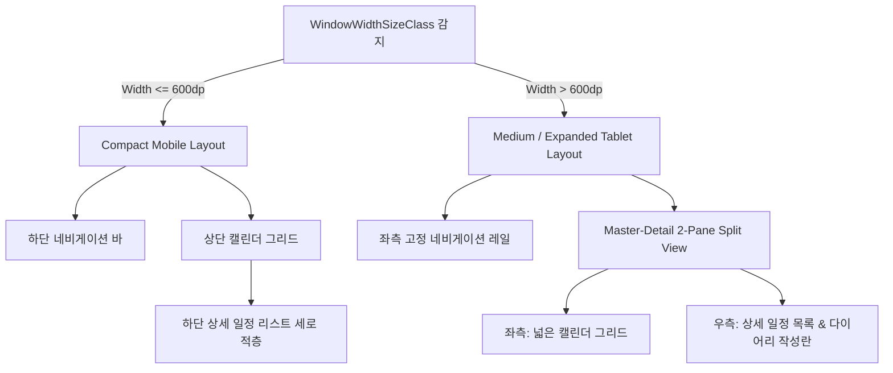

# UI/UX 및 디자인 시스템 가이드 (Material 3 기반)

본 문서는 `harulog` 애플리케이션의 시각적 일관성을 확보하고, 프리미엄급 사용자 경험(Premium Aesthetic)을 구축하기 위해 디자인 토큰과 UI 컴포넌트 설계 규격을 정의한다. 모든 UI 컴포넌트는 Jetpack Compose의 `MaterialTheme`를 확장하여 설계한다.

---

## 1. 컬러 시스템 (Color Palette)

시각적 신뢰감을 주는 딥 블루(Deep Blue)를 기본 컬러로 설정하고, 성취감을 상징하는 에메랄드 그린(Emerald Green) 및 개인 활동을 돋보이게 하는 코랄/핑크(Coral/Pink) 색상을 액센트 컬러로 활용한다.

| 디자인 토큰 명 | 대표 색상 (Hex) | 적용 예시 및 용도 |
| :--- | :--- | :--- |
| **LightPrimary** | `#4A69FF` (Slate Blue) | 메인 액션 버튼, 활성화 탭, 선택된 날짜 배경 원 |
| **LightSecondary** | `#788293` (Slate Gray) | 보조 텍스트, 비활성 아이콘, 헤더 보조 정보 |
| **LightTertiary** | `#FFFF7A59` (Modern Coral) | 개인 일정 포인트, 프로필 그라데이션 |
| **LightBackground** | `#F5F7FB` (Warm Off-White) | 전체 화면 배경색, 입력 필드 배경 |
| **LightSurface** | `#FFFFFF` (Pure White) | 개별 일정/기록 카드 배경, 다이얼로그 배경 |
| **WorkPrimaryColor** | `#1E3A8A` (Dark Blue / Navy) | 업무(Work) 카테고리 텍스트 및 좌측 포인트 라인 |
| **WorkBackgroundColor** | `#EFF6FF` (Light Blue) | 업무(Work) 일정 카드의 파스텔톤 배경 |
| **PersonalPrimaryColor** | `#EC4899` (Coral / Pink) | 개인(Personal) 카테고리 텍스트 및 좌측 포인트 라인 |
| **PersonalBackgroundColor** | `#FDF2F8` (Light Pink) | 개인(Personal) 일정 카드의 파스텔톤 배경 |
| **SuccessWorkoutColor** | `#10B981` (Emerald Green) | 운동 완료 날짜 셀 오버레이 배지, 토글 버튼 |
| **GrayBorderColor** | `#E2E8F0` (Slate-100 Border) | 카드 테두리선, 화면 분할 구분선 |

> [!TIP]
> **다크 모드 설계 고려 사항**
> 다크 모드 대응 시 Surface 색상은 `#1E1E24`, 배경은 `#121214`로 대응하여 가독성을 확보하고 깊이감(Elevation)에 따른 명도 차이를 둔다.

---

## 2. 타이포그래피 (Typography System)

가독성과 현대적인 느낌을 위해 시스템 기본 고딕 패밀리(또는 Inter/Roboto)를 사용하며, 타이틀과 본문의 명확한 굵기 대비(Weight Contrast)를 준다.

* **`Typography.titleLarge`**: 연/월 헤더, 주요 제목 (22sp, Bold, LineHeight: 28sp)
* **`Typography.bodyLarge`**: 다이어리 본문, 할 일 상세 내용 (16sp, Regular, LineHeight: 24sp)
* **`Typography.labelMedium`**: 카테고리 태그 칩, 달력 날짜, 보조 캡션 (12sp, Medium, LineHeight: 16sp)

---

## 3. Spacing & Grid System (여백 규격)

* **화면 여백(Screen Margin)**: `16.dp`
* **요소 간 간격(Spacer / Padding)**:
  * 대형 컴포넌트 간 간격: `16.dp`
  * 카드 내 내부 여백 (Content Padding): `12.dp`
  * 리스트 아이템 간 여백 (Gaps): `8.dp`
  * 미세 조정 여백 (Spacing): `4.dp` 또는 `6.dp`

---

## 4. 공통 UI 컴포넌트 설계 규격

### 4.1 Card 컴포넌트 (일정 / 할 일 / 다이어리 카드)
* **둥근 모서리 (Shape)**: 대외곽 카드 `RoundedCornerShape(24.dp)` 적용. 내부 아이템 및 리스트 카드는 `RoundedCornerShape(16.dp)`를 적용하여 곡선 위주의 부드러운 느낌을 부여한다.
* **테두리선 (Stroke)**: `border(width = 1.dp, color = GrayBorderColor)`를 추가해 카드 간의 시각적 경계를 정교하게 설정한다.
* **그림자 (Elevation)**: `shadow(elevation = 4.dp)`를 사용하여 배경 Surface로부터 플로팅된 느낌을 구현한다.

### 4.2 Left Accent Bar (일정 카드 왼쪽 포인트 바)
* 일정 카드 내부 좌측 끝단에 위치하는 수직 바.
* **크기**: 가로 `4.dp`, 세로 `24.dp` (둥근 모서리 `RoundedCornerShape(2.dp)`)
* **색상**: 카테고리에 맞춰 바인딩 (`WORK` = Dark Blue, `PERSONAL` = Pink/Coral).

### 4.3 Sticker 컴포넌트 (운동 달성 스티커)
* 달력 셀 상단에 배치되는 운동 완료 배지.
* **형태**: 지름 `10.dp` 크기의 원형 배지 (`SuccessWorkoutColor` 적용).

### 4.4 DateCell (달력 날짜 셀)
* **월간 뷰 선택 상태**: `LightPrimary` 색상 기반의 가로 그라데이션 원형 배경 (`30.dp` 크기), 텍스트는 흰색(`Color.White`) Bold.
* **주간 뷰 선택 상태**: Slate Blue ~ Royal Purple 그라데이션이 적용된 **세로형 캡슐(Vertical Capsule, `32.dp x 48.dp`, `RoundedCornerShape(16.dp)`)** 배경, 텍스트는 흰색 Bold.
* **오늘 날짜**: `LightBackground` 원형 또는 캡슐형 배경, 텍스트는 `LightPrimary` 색상 Bold.
* **하단 인디케이터**: 당일 할 일/일정 카테고리에 맞춰 가로로 긴 **둥근 미니 바(Bar) 형태의 칩** (`12.dp x 3.dp`, `RoundedCornerShape(1.5.dp)`) 배치.

### 4.5 Calendar Header (달력 헤더)
* **드롭다운형 헤더**: 달력 연/월 표시부 옆에 콤보 지시자인 하향 화살표(`Icons.Default.ExpandMore`) 아이콘을 배치하여, 직관적이고 세련된 날짜 선택 룩(UI Reference 스타일)을 부여한다.

### 4.5 TimePicker Dialog (시간 선택 다이얼로그)
* 일정(SCHEDULE) 등록/수정 시 시간 지정을 위해 플로팅되는 다이얼로그.
* **둥근 모서리 (Shape)**: `RoundedCornerShape(24.dp)` 적용.
* **배경색**: `MaterialTheme.colorScheme.surface`
* **내부 여백 (Padding)**: `20.dp`
* **구조**: 
  - 상단 중앙에 "시간 선택" 타이틀 (18sp, Bold).
  - 중앙에 Material 3 `TimePicker`를 배치하여 24시간 형식 지원.
  - 하단 우측에 '취소' 및 '확인' 액션 버튼 배치.

### 4.6 SegmentedControl (공통 세그먼트 토글 버튼)
* 2~3가지의 단일 선택 옵션을 직관적으로 제어하기 위해 사용되는 수평 토글 컨트롤.
* **트랙(배경) 규격**:
  - 높이: `40.dp`
  - 둥근 모서리: `12.dp`
  - 배경색: 라이트 모드 `#EFF1F5` (연한 회색), 다크 모드 `DarkSurface` (`#1E1E24`).
* **선택된 세그먼트 칩**:
  - 둥근 모서리: `8.dp`
  - 그림자: `shadow(2.dp)`로 약간 띄워진 입체감(Floating) 제공.
  - 배경색: 라이트 모드 흰색 (`#FFFFFF`), 다크 모드 `#2D3748`.
  - 텍스트 색상: 활성 상태 컬러 (기본은 `MaterialTheme.colorScheme.primary`, 카테고리 필터의 경우 각 카테고리의 Primary 색상 적용).
* **비선택 세그먼트**:
  - 배경색: 투명 (`Color.Transparent`).
  - 텍스트 색상: `onSurface.copy(alpha = 0.6f)`로 은은하게 비활성 상태 표현.

---

## 5. 반응형 레이아웃 정책 (Adaptive Responsive Layout)

다양한 모바일 해상도 및 폴더블, 태블릿 가로 모드에서 시각적 왜곡 없이 유연하게 화면을 재구성한다.

### 5.1 Compact (모바일 세로 모드)
* **네비게이션**: 하단 네비게이션 바 (Bottom Navigation) 적용.
* **레이아웃**: 캘린더 그리드가 상단에 위치하고, 선택된 날짜의 상세 일정 리스트가 하단에 결합되어 수직 스크롤로 읽히는 **세로 적층형 구조**를 이룬다.
* **달력 접기/펼치기 (Calendar Collapse/Expand)**: 
  - 모바일 세로 화면의 좁은 공간을 효율적으로 활용하기 위해, 달력 영역을 선택적으로 접거나 펼칠 수 있는 인터랙션을 탑재한다. (기본값은 펼침 상태: **Expand**)
  - 접힌 상태(**Collapsed**)에서도 상단의 일간/주간/월간 뷰 모드 전환 버튼(SegmentedControl)은 계속 노출되어야 한다.
  - 접기/펼치기 전환 시 하단의 오늘의 할 일 및 일정 카드 크기가 화면 전체를 활용하여 확장(Weight 비율 동적 조정)됨으로써 더 많은 일정을 한눈에 조망할 수 있도록 설계한다.

### 5.2 Medium / Expanded (태블릿 / 가로 모드)
* **네비게이션**: 좌측에 고정된 네비게이션 레일 (Navigation Rail) 적용.
* **레이아웃**: 화면 너비를 효율적으로 사용하는 **Master-Detail 분할 뷰(Split View)**를 적용한다.
  * **좌측 Pane (1.2 비율)**: 넓은 캘린더 그리드 배치.
  * **우측 Pane (1.0 비율)**: 상단에 선택 날짜의 할 일 목록, 하단에 다이어리 입력 및 수정란을 배치하여 두 레이어가 동시에 보이도록 설계한다.

---

## 6. 테마 설정 및 다크모드 대응 (Theme Configuration)

사용자의 시각적 편의성과 야간 가독성 개선을 위해 시스템 기본 설정에 맞춘 자동 전환 및 수동 선택 기능(라이트/다크)을 제공한다.

### 6.1 테마 모드 분류
1. **시스템 기본값 (SYSTEM)**: 안드로이드 OS의 다크 모드 활성화 여부를 자동으로 감지(`isSystemInDarkTheme()`)하여 적용한다.
2. **라이트 모드 (LIGHT)**: 시스템 모드와 관계없이 항상 밝은 배경(`LightColorScheme`) 테마를 적용한다.
3. **다크 모드 (DARK)**: 시스템 모드와 관계없이 항상 어두운 배경(`DarkColorScheme`) 테마를 적용한다.

### 6.2 테마 모드 선택 UI 규격
* **컴포넌트 구조**: Card 컴포넌트 형식 (`RoundedCornerShape(14.dp)`, `GrayBorderColor` 테두리 적용).
* **아이콘 및 타이틀**: `Icons.Outlined.Settings` 아이콘과 "디자인 테마 설정" 타이틀(15sp, Bold)을 수평 배치.
* **선택 방식**: `RadioButton` 및 세로로 정렬된 텍스트 칩을 사용하여 명료한 선택 경험 제공.
* **상태 영속성**: SharedPreferences를 통해 유저가 선택한 테마 설정을 기기에 로컬 저장하여, 앱이 종료되고 다시 켜져도 선택한 테마가 정합성 있게 유지되도록 설계한다.

---

## 7. 모바일 UI 디자인 원칙 (Design Principles for Mobile App)

`harulog` UI의 인터랙션과 시각적 요소는 안드로이드 모바일 환경의 하드웨어 특성 및 한 손 조작, 실외 시인성 등 고유한 사용자 컨텍스트를 지원하기 위해 아래 디자인 원칙을 엄격하게 준수해야 한다.

### 7.1 터치 편의성 및 영역 확보 (Touch Target Size)
* **최소 크기 규칙**: 모든 클릭 및 롱클릭이 가능한 컴포넌트(버튼, 라디오 버튼, 스위치, 탭, 날짜 셀 등)는 물리적 터치 오류를 줄이기 위해 최소 **`48.dp x 48.dp`** 이상의 터치 영역(Touch Target)을 확보해야 한다.
* **마진 규칙**: 인접한 대화형 요소 간에는 터치가 겹쳐 오작동하는 것을 방지하도록 최소 `8.dp` 이상의 Spacing을 둔다.

### 7.2 실외 시인성 및 대비 수준 (Contrast & Visibility)
* **대비비 충족**: 실외 직사광선 환경에서도 화면 내용이 뚜렷하게 식별되도록 텍스트와 배경의 명도 대비 비율을 최소 **4.5:1** (본문 텍스트 기준) 또는 **3:1** (큰 제목 텍스트 기준) 이상을 유지한다.
* **동적 대비 조정**: 다크 모드 활성화 시 명도 대비의 급격한 격차로 인한 눈의 피로를 방지하기 위해 순수 검정색 배경(`#000000`)보다는 딥 차콜/다크 그레이 계열(`#121214`)을 사용하며, 글자 색상 또한 다소 부드러운 화이트 계열을 바인딩한다.

### 7.3 한 손 조작성 중심 레이아웃 (Thumb Zone Optimization)
* **하단 배치 지향**: 엄지손가락으로 쉽게 닿을 수 있는 하단 영역(화면 밑에서 30% 이내 범위)에 탭 전환 바, 등록 버튼, 다이얼로그 확인 버튼 등 가장 빈번한 핵심 액션을 집중 배치한다.
* **상단 헤더 최소화**: 정보의 전달을 돕는 연/월 표시나 날짜 범위 텍스트 등 읽기 중심의 메타 데이터는 상단 영역에 고정하여 조작과 인지의 영역을 물리적으로 명확하게 구분한다.

### 7.4 물리 피드백 및 터치 응답성 (Tactile Feedback)
* **클릭 피드백 (Ripple)**: 사용자가 요소를 터치했을 때 시스템이 즉각 반응했음을 신뢰할 수 있도록 Material Design의 **`clickable`** 또는 **`combinedClickable`**을 통한 물결 효과(Ripple Effect) 피드백을 반드시 바인딩해야 한다.
* **상태 전이 시각화**: 로딩 시에는 가벼운 스켈레톤 애니메이션이나 진행 바를 노출하여 앱이 멈춘 것처럼 보이지 않도록 즉각적인 피드백을 제공한다.

