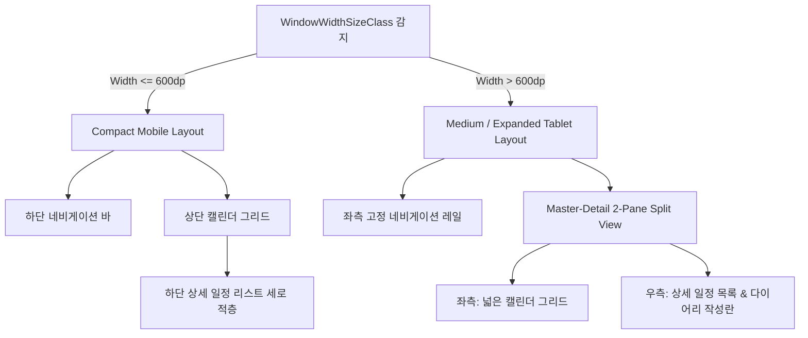

# UI/UX 및 디자인 시스템 가이드 (Material 3 기반)

본 문서는 `harulog` 애플리케이션의 시각적 일관성을 확보하고, 프리미엄급 사용자 경험(Premium Aesthetic)을 구축하기 위해 디자인 토큰과 UI 컴포넌트 설계 규격을 정의한다. 모든 UI 컴포넌트는 Jetpack Compose의 `MaterialTheme`를 확장하여 설계한다.

---

## 1. 컬러 시스템 (Color Palette)

시각적 신뢰감을 주는 딥 블루(Deep Blue)를 기본 컬러로 설정하고, 성취감을 상징하는 에메랄드 그린(Emerald Green) 및 개인 활동을 돋보이게 하는 코랄/핑크(Coral/Pink) 색상을 액센트 컬러로 활용한다.

| 디자인 토큰 명 | 대표 색상 (Hex) | 적용 예시 및 용도 |
| :--- | :--- | :--- |
| **LightPrimary** | `#4A69FF` (Slate Blue) | 메인 액션 버튼, 활성화 탭, 선택된 날짜 배경 원 |
| **LightSecondary** | `#788293` (Slate Gray) | 보조 텍스트, 비활성 아이콘, 헤더 보조 정보 |
| **LightTertiary** | `#FFFF7A59` (Modern Coral) | 개인 일정 포인트, 프로필 그라데이션 |
| **LightBackground** | `#F5F7FB` (Warm Off-White) | 전체 화면 배경색, 입력 필드 배경 |
| **LightSurface** | `#FFFFFF` (Pure White) | 개별 일정/기록 카드 배경, 다이얼로그 배경 |
| **WorkPrimaryColor** | `#1E3A8A` (Dark Blue / Navy) | 업무(Work) 카테고리 텍스트 및 좌측 포인트 라인 |
| **WorkBackgroundColor** | `#EFF6FF` (Light Blue) | 업무(Work) 일정 카드의 파스텔톤 배경 |
| **PersonalPrimaryColor** | `#EC4899` (Coral / Pink) | 개인(Personal) 카테고리 텍스트 및 좌측 포인트 라인 |
| **PersonalBackgroundColor** | `#FDF2F8` (Light Pink) | 개인(Personal) 일정 카드의 파스텔톤 배경 |
| **SuccessWorkoutColor** | `#10B981` (Emerald Green) | 운동 완료 날짜 셀 오버레이 배지, 토글 버튼 |
| **GrayBorderColor** | `#E2E8F0` (Slate-100 Border) | 카드 테두리선, 화면 분할 구분선 |

> [!TIP]
> **다크 모드 설계 고려 사항**
> 다크 모드 대응 시 Surface 색상은 `#1E1E24`, 배경은 `#121214`로 대응하여 가독성을 확보하고 깊이감(Elevation)에 따른 명도 차이를 둔다.

---

## 2. 타이포그래피 (Typography System)

가독성과 현대적인 느낌을 위해 시스템 기본 고딕 패밀리(또는 Inter/Roboto)를 사용하며, 타이틀과 본문의 명확한 굵기 대비(Weight Contrast)를 준다.

* **`Typography.titleLarge`**: 연/월 헤더, 주요 제목 (22sp, Bold, LineHeight: 28sp)
* **`Typography.bodyLarge`**: 다이어리 본문, 할 일 상세 내용 (16sp, Regular, LineHeight: 24sp)
* **`Typography.labelMedium`**: 카테고리 태그 칩, 달력 날짜, 보조 캡션 (12sp, Medium, LineHeight: 16sp)

---

## 3. Spacing & Grid System (여백 규격)

* **화면 여백(Screen Margin)**: `16.dp`
* **요소 간 간격(Spacer / Padding)**:
  * 대형 컴포넌트 간 간격: `16.dp`
  * 카드 내 내부 여백 (Content Padding): `12.dp`
  * 리스트 아이템 간 여백 (Gaps): `8.dp`
  * 미세 조정 여백 (Spacing): `4.dp` 또는 `6.dp`

---

## 4. 공통 UI 컴포넌트 설계 규격

### 4.1 Card 컴포넌트 (일정 / 할 일 / 다이어리 카드)
* **둥근 모서리 (Shape)**: 대외곽 카드 `RoundedCornerShape(24.dp)` 적용. 내부 아이템 및 리스트 카드는 `RoundedCornerShape(16.dp)`를 적용하여 곡선 위주의 부드러운 느낌을 부여한다.
* **테두리선 (Stroke)**: `border(width = 1.dp, color = GrayBorderColor)`를 추가해 카드 간의 시각적 경계를 정교하게 설정한다.
* **그림자 (Elevation)**: `shadow(elevation = 4.dp)`를 사용하여 배경 Surface로부터 플로팅된 느낌을 구현한다.

### 4.2 Left Accent Bar (일정 카드 왼쪽 포인트 바)
* 일정 카드 내부 좌측 끝단에 위치하는 수직 바.
* **크기**: 가로 `4.dp`, 세로 `24.dp` (둥근 모서리 `RoundedCornerShape(2.dp)`)
* **색상**: 카테고리에 맞춰 바인딩 (`WORK` = Dark Blue, `PERSONAL` = Pink/Coral).

### 4.3 Sticker 컴포넌트 (운동 달성 스티커)
* 달력 셀 상단에 배치되는 운동 완료 배지.
* **형태**: 지름 `10.dp` 크기의 원형 배지 (`SuccessWorkoutColor` 적용).

### 4.4 DateCell (달력 날짜 셀)
* **선택 상태**: `LightPrimary` 색상의 원형 배경 (`32.dp` 크기), 텍스트는 흰색(`Color.White`) Bold.
* **오늘 날짜**: `LightBackground` 원형 배경, 텍스트는 `LightPrimary` 색상 Bold.
* **하단 인디케이터**: 당일 할 일/일정 카테고리에 맞춰 작은 닷(`4.dp` 원형) 표시.

---

## 5. 반응형 레이아웃 정책 (Adaptive Responsive Layout)

다양한 모바일 해상도 및 폴더블, 태블릿 가로 모드에서 시각적 왜곡 없이 유연하게 화면을 재구성한다.

### 5.1 Compact (모바일 세로 모드)
* **네비게이션**: 하단 네비게이션 바 (Bottom Navigation) 적용.
* **레이아웃**: 캘린더 그리드가 상단에 위치하고, 선택된 날짜의 상세 일정 리스트가 하단에 결합되어 수직 스크롤로 읽히는 **세로 적층형 구조**를 이룬다.

### 5.2 Medium / Expanded (태블릿 / 가로 모드)
* **네비게이션**: 좌측에 고정된 네비게이션 레일 (Navigation Rail) 적용.
* **레이아웃**: 화면 너비를 효율적으로 사용하는 **Master-Detail 분할 뷰(Split View)**를 적용한다.
  * **좌측 Pane (1.2 비율)**: 넓은 캘린더 그리드 배치.
  * **우측 Pane (1.0 비율)**: 상단에 선택 날짜의 할 일 목록, 하단에 다이어리 입력 및 수정란을 배치하여 두 레이어가 동시에 보이도록 설계한다.
