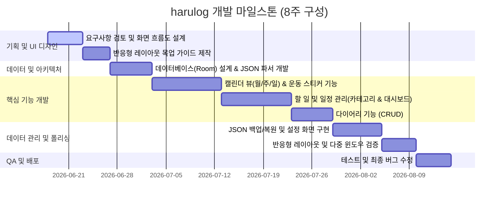

# [PRD] harulog - 통합 일정 관리 Android 애플리케이션

## 1. 문서 개요 (Document Overview)
* **작성일**: 2026년 6월 17일
* **대상 독자**: 제품 기획자, 안드로이드 개발자, UX/UI 디자이너
* **문서 상태**: Draft (초안)

---

## 2. 핵심 가치 및 목표 (Core Value & Goals)
본 제품은 **캘린더, 할 일 관리, 다이어리**를 하나의 유기적인 인터페이스로 통합한 모바일 환경을 제공합니다. 사용자가 일상과 업무, 그리고 성취(운동)를 한곳에서 직관적으로 기록하고 관리하여 개인 삶의 균형과 성장을 유지하도록 돕는 것을 목표로 합니다.

---

## 3. 제품 정의 (Product Definition)

### 3.1 제품 비전 (Product Vision)
> *"나의 하루, 나의 일과 성취를 한눈에 담다."*  
`harulog`는 파편화된 생산성 도구들(캘린더, To-Do, 다이어리)을 단 하나의 안드로이드 애플리케이션으로 결합하여 일상의 모든 순간을 안전하게 로깅할 수 있는 환경을 선사합니다.

### 3.2 타겟 사용자 (Target Audience)
* **멀티태스킹이 일상인 유저**: 업무(Work)와 개인(Personal) 일정을 하나의 앱에서 완벽히 분리 및 통합해서 확인하고 싶은 사용자.
* **운동 및 일상 성취 기록가**: 매일 운동 성공 여부나 사소한 목표 달성을 스티커나 아이콘을 통해 시각적으로 쉽게 모니터링하고 싶은 사용자.
* **가벼운 글쓰기 기록가**: 매일의 감정이나 일어난 일들을 텍스트 형태로 간편하게 아카이빙하고 싶은 사용자.

---

## 4. 상세 기능 요구사항 (Detailed Feature Requirements)

### 4.1 캘린더 (Calendar)
* **[FR-1.1] 캘린더 월간 뷰 고정 및 목록 범위 전환**: 
  * 캘린더 자체는 항상 **월간(Month) 그리드** 형태로 유지되어 전체 한 달 일정을 조망할 수 있어야 함.
  * 상단 탭 선택기(일간, 주간, 월간)의 상태 변경 시 캘린더 모양이 아닌 **하단의 할 일 및 일정 목록의 쿼리 범위**가 선택일 기준으로 각각 당일(Day), 해당 주(Week), 해당 월(Month)로 동적 전환 및 필터링되어 보여야 함.
* **[FR-1.2] 일정/할 일 인디케이터**:
  * 각 날짜 셀 내에 해당 일자에 등록된 일정이나 할 일의 존재 여부를 시각적으로 표시함.
  * 카테고리(업무/개인)에 맞는 **컬러 닷(Color Dot)** 형태로 다중 표시가 가능해야 함.
* **[FR-1.3] 운동 체크 스티커**:
  * 특정 날짜 셀에 사용자가 운동 달성 여부를 직관적으로 기록 및 확인할 수 있는 **스티커(아이콘)** 표시 영역을 제공해야 함.
  * 캘린더 메인 화면이나 빠른 입력 패널을 통해 쉽게 체크/해제할 수 있어야 함.

### 4.2 할 일 및 일정 관리 (Todo & Schedule)
* **[FR-2.1] 카테고리 구분 (Category)**:
  * 모든 일정과 할 일은 **'업무(Work)'**와 **'개인(Personal)'** 카테고리로 명확하게 분류 가능해야 함.
  * 카테고리에 따라 UI의 메인 색상 테마 또는 태그 디자인이 다르게 표시되어야 함.
* **[FR-2.2] 모아보기 대시보드 뷰 (Dashboard)**:
  * 할 일과 일정을 **일간, 주간, 월간** 단위로 일괄 수집하여 보여주는 전용 대시보드 뷰 제공.
* **[FR-2.3] 할 일(Todo) 유형 분류**:
  1. **D-Day형 할 일 (Target Date)**: 특정 날짜까지 완수해야 하는 할 일로, 기한(Due Date)이 존재하며 캘린더에 표시됨.
  2. **월간 범위형 할 일 (Monthly Scope)**: 구체적인 일자는 정해지지 않았으나 이번 달 내에 처리해야 하는 할 일로 구성.
* **[FR-2.4] 날짜 범위 동적 표시 (Active Range Indicator)**:
  * 일간/주간/월간 탭 선택 및 날짜 선택에 따라 현재 하단 목록에 표시 중인 일정의 정확한 날짜 범위를 동적으로 화면에 표시해야 함 (예: 일간 - 6월 17일, 주간 - 6월 14일 ~ 6월 20일, 월간 - 6월 1일 ~ 6월 30일).
* **[FR-2.5] 롱프레스 관리 인터페이스 (Long-press management options)**:
  * 기 등록된 일정 혹은 할 일 카드 항목을 길게 누르면(Long Press) 해당 항목을 편집(수정)하거나 즉시 삭제할 수 있는 옵션(다이얼로그)을 제공함.
  * 수정 버튼을 선택하면 기존 데이터가 사전 입력(Pre-fill)된 다이얼로그를 통해 Room 데이터베이스의 항목 정보가 갱신되어야 함.
* **[FR-2.6] 일정 등록 시 시간 지정 및 하루 종일 선택**:
  * 일정(SCHEDULE) 등록/수정 시, '하루 종일' 여부를 전환할 수 있는 Switch UI를 제공함.
  * '하루 종일'이 비활성화된 경우, 시작 시간(Start Time)과 종료 시간(End Time)을 각각 다이얼로그 방식의 TimePicker를 통해 정밀하게 입력할 수 있는 옵션을 제공함.
  * 시간 입력 시 Android Jetpack Compose Material3의 TimePicker API를 사용하여 직관적인 UI 경험을 제공함.
* **[FR-2.7] 한달 요약 대시보드 리포트 (Monthly Dashboard Summary)**:
  * 대시보드 진입 시 당월 일정과 할 일 데이터에 대한 "한달 요약 리포트" 정보를 한눈에 볼 수 있도록 구성함.
  * **AI 일정 요약**: AI를 활용한 당월 일정/할 일 요약 플레이스홀더를 제공함.
  * **운동 달성 요약**: 당월 운동 체크 스티커의 활성화 횟수를 집계하여 보여주고, 성취 단계에 맞춤형 동기부여 문구를 고대비로 표시함.
  * **연차 사용 현황**: 당월에 사용한 연차의 총 횟수와 상세 날짜 리스트(예: 6/15, 6/17, 6/20)를 노출함.
  * **장기 일정 하이라이트**: 당월 일정 중 동일한 제목으로 2일 이상 연속 등록된 가장 긴 일정 구간을 감지하여 대시보드 최상단에 하이라이트 형태로 강조 표시(예: 크로아티아 여행 6/12 ~ 6/15)함.
  * **회의 일정 요약**: 이달의 일정 중 제목에 '회의', '논의', '검토'가 포함된 일정을 모아서 '이번 달 일정 요약' 영역에 리스트 형태로 노출함.

### 4.3 다이어리 (Diary)
* **[FR-3.1] 날짜별 기록 1개 제한**:
  * 하루 단위로 1개의 텍스트 중심 다이어리만 작성할 수 있도록 강제함.
* **[FR-3.2] 다이어리 CRUD**:
  * 텍스트 입력, 저장, 수정 및 삭제 기능을 직관적인 에디터 UI 형태로 제공함.
  * 캘린더 일간 뷰나 대시보드 뷰에서 즉시 접근하여 기록할 수 있도록 연동함.
* **[FR-3.3] 달력 날짜 선택 시 기록 여부 마킹 (Diary Date Indicator)**:
  * 다이어리 화면의 날짜 퀵 메뉴를 통해 달력을 띄웠을 때, 다이어리가 이미 작성된 과거의 날짜들을 시각적으로 인지할 수 있도록 일자 셀 하단에 컬러 Dot(도트) 마킹을 노출해야 함.

### 4.4 데이터 관리 (Data Management)
* **[FR-4.1] 로컬 저장 우선 (Offline-First)**:
  * 별도의 클라우드 서버나 로그인 없이 모든 데이터를 기기 내부(App Local Sandbox 내의 SQLite/Room Database)에 안전하게 저장함.
* **[FR-4.2] JSON 기반 백업 및 복원**:
  * **내보내기 (Export)**: 데이터 유실 방지를 위해 사용자가 저장된 전체 데이터를 표준 JSON 파일 형태로 로컬 저장소에 내보낼 수 있어야 함.
  * **가져오기 (Import)**: 외부 JSON 파일을 읽어 기존 로컬 데이터베이스를 복원(Merge 또는 Overwrite 정책은 기획 단계에서 확정)하는 기능을 제공해야 함.
* **[FR-4.3] 데이터 완전 편집 권한**:
  * 사용자가 작성한 모든 데이터(일정, 할 일, 다이어리, 운동 스티커)는 제약 없이 상시 수정 및 삭제가 완벽히 보장되어야 함.

### 4.5 UI/UX 및 반응형 대응 (Responsive UX)
* **[FR-5.1] 반응형 레이아웃**:
  * 다양한 화면 해상도, 폴더블폰(Foldable), 멀티 윈도우(Multi-Window) 환경을 안정적으로 지원해야 함.
  * 디바이스의 화면 가로/세로 회전(Landscape/Portrait) 시 끊김 없이 UI 레이아웃이 유동적으로 재배치되어야 함.
* **[FR-5.2] 디자인 테마 모드 선택 (System/Light/Dark Theme)**:
  * 설정 화면을 통해 사용자가 '시스템 기본값', '라이트 모드', '다크 모드' 중 원하는 테마 모드를 직접 선택할 수 있어야 함.
  * 선택된 테마 설정은 앱을 종료하더라도 SharedPreferences에 영속적으로 저장되어 재접속 시에도 온전히 유지되어야 함.
  * 테마 선택 시 앱 전체의 Color Scheme이 실시간으로 전환 및 반영되어야 함.
* **[FR-5.3] Edge-to-Edge 및 시스템 인셋 대응**:
  * 애플리케이션의 뷰가 시스템 상태 바 및 내비게이션 바 영역 뒤로 흐르도록 Edge-to-Edge를 적용하여 현대적인 화면 구성을 선사함.
  * 리스트 및 카드 입력 컴포넌트 등은 시스템 바의 물리적 위치(WindowInsets)를 동적으로 인식하여 텍스트가 가려지거나 터치 영역이 침범당하지 않도록 안전 패딩을 적용함.
* **[FR-5.4] 프리미엄 Clay-Glassmorphism 하단 내비게이션 바**:
  * 하단 내비게이션 바는 모던하고 입체감 있는 Clay-Glassmorphism 비주얼을 제공해야 함.
  * **레이어 격리 렌더링**: 자식 콘텐츠(Text, Icon)와 외곽 그라데이션 보더 및 3D 광택 셰이더가 블러 효과에 의해 뭉개지지 않도록, 실시간 배경 블러 레이어와 광택/보더 레이어를 완전히 격리하여 선명하게 렌더링해야 함.
  * **입체 3D 셰이더 및 하이라이트**: 고해상도 모바일 화면에 맞춰 Bevel Highlight와 Bevel Shadow의 두께를 충분히(6.0px) 확보하여 영롱한 유리 질감을 묘사해야 함.
  * **좌상단 투명 틴트 글로우**: 라이트 모드 오프화이트 배경 위에서도 하단 바의 윤곽이 드러나도록, 불투명한 채우기를 배제하고(`Style.STROKE` 적용) 청명한 스카이 블루 틴트 글로우(`Color.argb(220, 180, 215, 255)`)를 섀도우 레이어로 얹어 외곽 반사광을 극대화함.
  * **백그라운드 가독성 보호 (Acrylic Frosted Shield)**: 탭 바 아래를 스크롤해 지나가는 본문 텍스트들이 탭 바 내부 텍스트와 겹쳐 시인성이 떨어지지 않도록, 아크릴 투명도를 영롱하게 상향(라이트 모드 `0.78f`, 다크 모드 `0.82f`)하고 셰이더 노이즈(Frosted Noise) 강도를 `0.065`로 강화하여 뒤편 글자의 테두리를 완전히 뽀얗게 뭉개는 차단막(Shield)을 형성해야 함.
  * **선택 탭 액체 하이라이트 (Liquid Indicator)**: 선택된 탭 인디케이터가 뽀얀 아크릴 유리 쉴드 위에서도 충분한 색상 대비를 얻도록 투명도 강도를 상향(라이트 `0.60f`, 다크 `0.55f`)하고, 프레임 드랍을 막기 위해 셰이더 브러시의 `remember` 키를 최적화하여 60Hz/120Hz 속도로 쫀득하게 늘어나는 네이티브 Metaball 애니메이션을 완벽히 제공함.

---

## 5. 비기능 요구사항 (Non-Functional Requirements)

### 5.1 성능 및 안정성 (Performance)
* **화면 렌더링 성능**: 캘린더 뷰 전환 및 스크롤 시 프레임 드랍(Jank)이 발생하지 않고 부드럽게 렌더링되어야 함.
* **데이터 정합성**: 백업/복원 진행 시 데이터 파싱 에러나 데이터 누락이 없도록 JSON 스키마 버전을 관리해야 함.

### 5.2 보안 (Security)
* **개인정보 보호**: 다이어리 및 일상 정보가 포함되므로 로컬에 암호화되지 않은 민감 정보가 외부에 노출되지 않도록 하며, 백업용 파일 생성 시 안드로이드의 SAF(Storage Access Framework)를 준수해야 함.

---

## 6. 안드로이드 추천 기술 스택 (Technical Architecture)

| 구분 | 기술 스택 | 적용 용도 및 특징 |
| :--- | :--- | :--- |
| **언어** | Kotlin | 최신 언어 사양 활용 및 코루틴 기반 비동기 처리 |
| **UI 프레임워크** | Jetpack Compose | 선언형 UI, `Adaptive/WindowSizeClass`를 통한 폴더블 및 화면 회전 반응형 레이아웃 구현 |
| **로컬 DB** | Room Database | 데이터 영속성 보장, SQLite 추상화 레이어 제공 |
| **직렬화 라이브러리** | Kotlinx Serialization | 로컬 데이터를 JSON 포맷으로 백업 및 복원하는 데 활용 |
| **아키텍처 패턴** | MVVM + Clean Architecture | Repository 패턴을 활용하여 Room 데이터 모델과 UI 모델 분리 |
| **의존성 주입** | Hilt | 의존성 역전을 통해 모듈 확장성 및 단위 테스트 성능 극대화 |

---

## 7. 개발 로드맵 (Roadmap)

